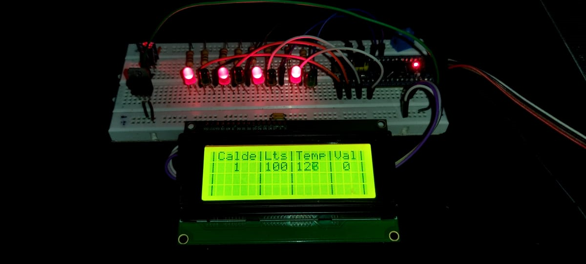

# Tablero de control LCD

Tablero de control LCD (19099537) es un tablero de control en una pantalla LCD 20x4, el cual consta de 4 columnas correspondientes a la caldera, litros, temperatura y valvula.

<h3 align="center">
  
</h3>

## Funcionamiento
* La caldera uno cumple la función de recoger el liquido. Asímismo, genera  la  primera cocción.  Para esto la caldera uno contara con una capacidad de 100 litros y debe trabajar a 150 grados centígrados.
* Cuando la caldera uno llega a los 150 grados deberá permanecer en esa temperatura durante 1 minuto posterior a eso abrirá la válvula para llevar el liquido precocido a la caldera dos, la cual funciona a 200 grados con una capacidad de 90 litros, por lo que la condición es que la  caldera dos tenga la temperatura correcta y la caldera uno tenga la temperatura y litros correctos.
* La caldera dos dura en la temperatura de 200 grados un minuto, posterior a eso abre  la  valvula 2 entrega los liquidos a la caldera cuatro, la cual trabaja a una temperatura de 250 grados con una capacidad de 90 litros. La temperatura de la caldera cuatro dura 1 minuto antes de abrir la válvula 3.
* La caldera cuatro entrega a la caldera tresque tendrá una temperatura de 300 grados con una capacidad de 90 litros y durará 1min antes de abrir la válvula 4.

## Author

**Jair Copete**

[**Github**](https://github.com/JairCopete17)
